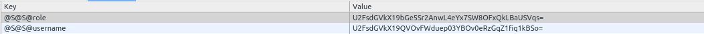

# Secure Local Storage
Javascript Library to make secure local storage with encryption. Based on [secure-local-storage.js](https://github.com/BosNaufal/secure-string-js).

[DEMO](https://rawgit.com/BosNaufal/secure-local-storage/dev/index.html)


Local storage is the easiest way ( I Think ) to make a "session like" in the Single Page Application (SPA), but there is another choice, using cookies. As a junior, I prefer using local storage than cookies. And sometime, I need to store important data in the Local Storage but it will make the data unsafe since it's easy to inject and change via developer tools.

So, I decided to make Secure Local Storage to encrypt Local Storage data and concat it. Hopefully, it will make Local Storage become safer and hard to inject. Your local storage will looks like this.





## Install
Include the [secure-local-storage.js](./secure-local-storage.js) to your HTML or import it to your module (es6/node), Then it's ready to run.

## Usage
```javascript

// Set Your password ( Only Once )
secureStorage.setPassword('myPass');

// Set some value
secureStorage.set('username','BosNaufal');
// or you can use this way
secureStorage.set({ username: 'BosNaufal' });

// Get your local storage value
secureStorage.get('username'); // Return BosNaufal


/**
If you have a wrong password you will get undefined
**/

// Set Wrong Password
secureStorage.setPassword('wrongPass');

// Get your local storage value with wrong password
secureStorage.get('username'); // Return undefined


// set to your correct password
secureStorage.setPassword('myPass');

// get it again
secureStorage.get('username'); // Return BosNaufal
```

## API

#### setPassword(pass)
Set a new Password. You only need to set it once. Don't worry, the Secure Local Storage will keep your password and will not share it.

#### set( data )
To set a new value or just update the current Secure Local Storage data.

```javascript
// Set some index and value
secureStorage.set('username','BosNaufal');
// or you can use this way
secureStorage.set({
  id: '4',
  username: 'BosNaufal',
  role: 'user',
});
```

#### get( index )
Get the Secure Local Storage Data if you're already to set the password.
```javascript
// Get Username
secureStorage.get('id'); // return '4'
secureStorage.get('username'); // return 'BosNaufal'
secureStorage.get('role'); // return 'user'
```


## Hopefully it can be useful~

## Let's talk about some projects
Just Contact Me At:
- Email: [bosnaufalemail@gmail.com](mailto:bosnaufalemail@gmail.com)
- Skype Id: bosnaufal254
- twitter: [@BosNaufal](https://twitter.com/BosNaufal)

## License
[MIT](http://opensource.org/licenses/MIT)
Copyright (c) 2016 - forever Naufal Rabbani
